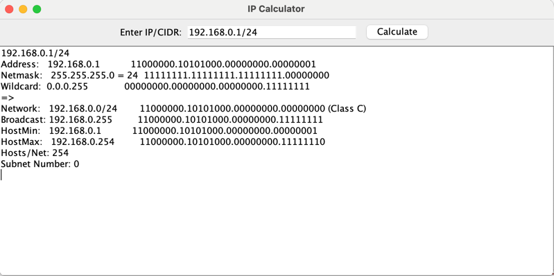

# IP Calculator

## Project Overview

IP Calculator is a Java application that calculates various IP-related details, such as network address, broadcast address, subnet mask, wildcard mask, and more. The project includes a graphical user interface (GUI) that allows users to input an IP address and view the calculated results.

## Directory Structure
```
ip-calculator/
├── src/
│   ├── IpCalculator.java
│   ├── IpCalculatorGUI.java
│   └── Main.java
├── README.md
└── .gitignore
```
## Features

- Calculate the binary representation of an IP address
- Calculate subnet mask and wildcard mask
- Calculate network address and broadcast address
- Calculate the minimum and maximum host addresses
- Calculate the number of hosts per network
- Provide a graphical user interface for user input and result display

## Usage

### Prerequisites

- Java Development Kit (JDK 8 or higher)
- Git (for cloning the project and version control)


###Using Command Line Interface (CLI)

1.	Open a terminal and navigate to the project directory. 
2.  Compile the project:
```cmd
javac src/*.java -d out
```
3.	Run the project:
```cmd
java -cp out Main
```

Using the IP Calculator GUI

	1.	After starting the program, a window will appear.
	2.	Enter the IP address and subnet mask length in the “Enter IP/CIDR” text box (e.g., 192.168.0.1/24).
	3.	Click the “Calculate” button.
	4.	The calculation results will be displayed in the result area.
Example
```
Input 192.168.0.1/24, the output might be as follows:

Address:   192.168.0.1           11000000.10101000.00000000.00000001
Netmask:   255.255.255.0 = 24    11111111.11111111.11111111.00000000
Wildcard:  0.0.0.255             00000000.00000000.00000000.11111111
=>
Network:   192.168.0.0/24        11000000.10101000.00000000.00000000 (Class C)
Broadcast: 192.168.0.255         11000000.10101000.00000000.11111111
HostMin:   192.168.0.1           11000000.10101000.00000000.00000001
HostMax:   192.168.0.254         11000000.10101000.00000000.11111110
Hosts/Net: 254
Subnet Number: 0
```

